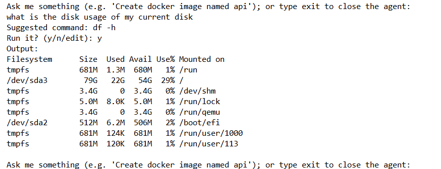
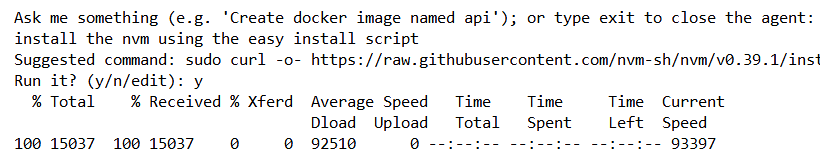

# Hippo Shell
Leveraging the capabilities of ollama, <b>hippo-shell</b> is a
linux assistant that can automatically execute shell commands offering a
shell-less experience where developers, system administrators and users can
accelerate their bash, system tasks.

### Installation

EDIT TERMINFO env var with
<code>
export TERMINFO=/usr/share/terminfo
</code>

Clone repository and run the
<code>
package.sh
</code>
then execute with <code>./build/hippo-shell</code> optionally can be added to user/systems path. Then can be run as <code>hippo-shell</code>

### Description

The agent can automatically (either with or without user supervision) execute shell commands like the following

User prompt

>I want to pull and execute a nginx container on port 8086

The agent will execute a code like this

<code>
docker pull nginx && 
docker run -t server -p 8086:8080 nginx
</code>

# Specs

- It uses ollama:llama3.2 no network access required
- User confirms (edits) commands before execution
- User can enrich context (pending)
- Automatic system tunning after installation (pending)
- Build a TUI with ncurses or fzf-style interface (pending)

### Showcase

---

---

